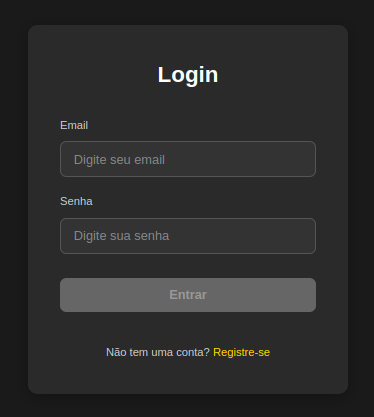
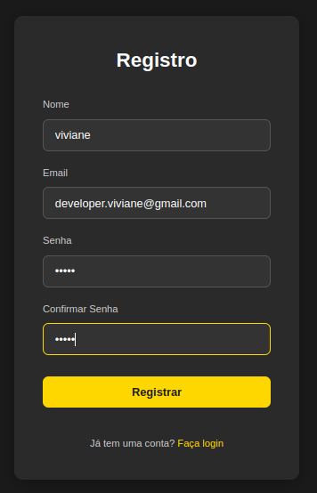
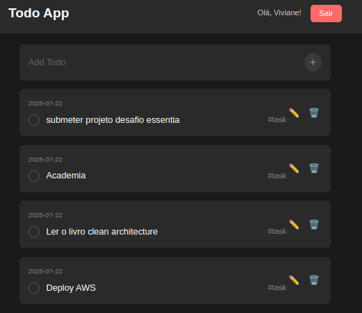

# DESAFIO ESSENTIA

Essa aplicação é um Todo-list construída com `Angular` no frontend e `Nodejs` no backend.


### Tela de login.


### Tela de registro.


### Dashboard Todo.


## Inicialização do backend 

### Pré requisitos: 

Nodejs - V22.17.1

Docker - V27.3.1

Essa configuração tem três etapas.

- Instalação de pacotes.
- Configuração do banco de dados. 
- Inicialização do frontend.

### Configuração do banco de dados com docker.

Construindo um container com mysql 

```sh
docker compose -f docker-mysql.yml up -d
```
Verificando se o docker foi inicializado corretamente. 

```sh
docker ps 

CONTAINER ID   IMAGE                COMMAND                  CREATED          STATUS          PORTS                                                  NAMES
c9f036bbbc7f   mysql:8.0            "docker-entrypoint.s…"   49 minutes ago   Up 49 minutes   0.0.0.0:3306->3306/tcp, :::3306->3306/tcp, 33060/tcp   mysql_todo
```


### Instalação de pacotes.

- Instalação de pacotes `inicialização do projeto` 

No diretório principal

```sh 
npm i  
``` 

Configuração de variáveis de ambiente.

Renomear o `.env_example` para `.env` 

Preparando as tabelas no banco de dados. 

```sh
npx prisma migrate dev

# caso o comando acima falhe.

npx prisma migrate dev --name ajuste-manual

```

## Frontend

Configuração do frontend.

Navegue até o diretório frontend. 

Instalando os pacotes.

```sh
npm i 
```
Inicializando a aplicação. 

```sh
npm start
```


